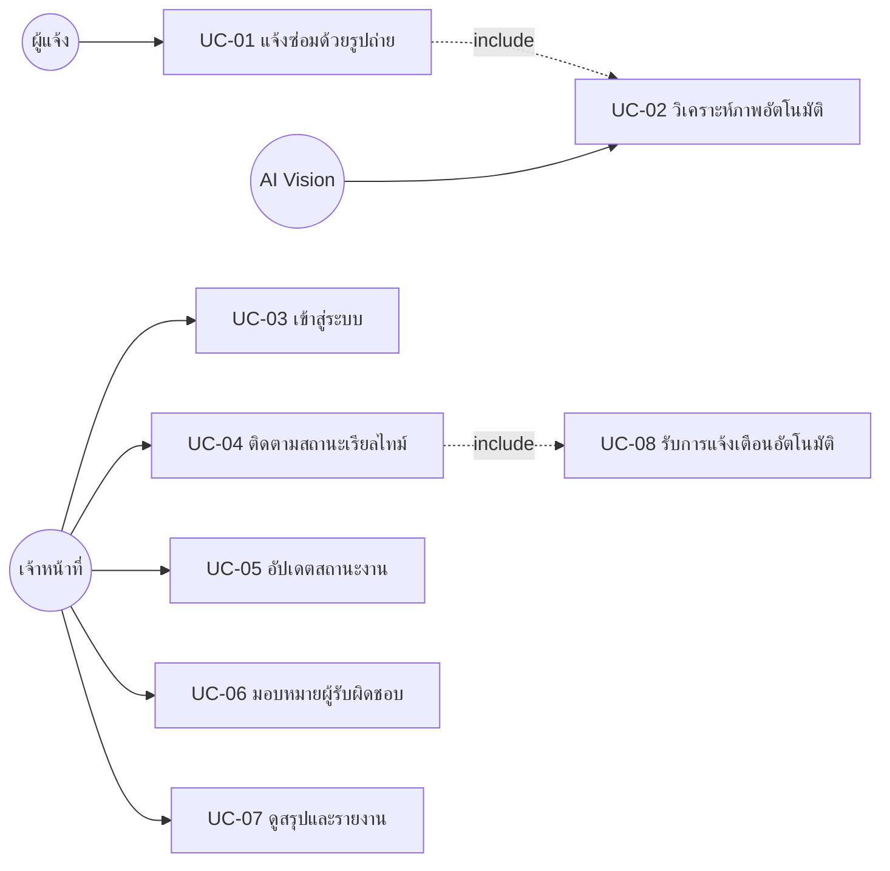

# Use Cases — ระบบบริหารการซ่อมบำรุงด้วย AI

## Actors

| Actor | คำอธิบาย |
|---|---|
| **ผู้แจ้ง (Reporter)** | นักศึกษา/บุคลากร — ใช้งานได้ทันทีไม่ต้องล็อกอิน |
| **เจ้าหน้าที่ (Staff)** | ช่าง/ผู้ดูแลระบบซ่อมบำรุง — ล็อกอินก่อนใช้งาน |
| **AI (Vision LLM)** | ระบบวิเคราะห์ภาพ — ทำงานอัตโนมัติเบื้องหลัง |

## Use Case Diagram

---

## UC-01 แจ้งซ่อมด้วยรูปถ่าย

| | |
|---|---|
| **Actor** | ผู้แจ้ง |
| **Precondition** | เข้าถึงหน้า `/report` ได้ (ไม่ต้องล็อกอิน) |
| **Main Flow** | 1. เปิดหน้าแจ้งซ่อม → 2. แตะถ่ายรูป (กล้องเปิดอัตโนมัติ) → 3. เลือกอาคาร → 4. เลือกห้อง → 5. กดส่ง |
| **Alternate** | 5a. เลือกประเภทงานเองได้ (ไม่เลือก = AI จัดให้) · 5b. กรอกชื่อ/เบอร์ติดต่อ (ไม่บังคับ) |
| **Exception** | รูปไม่ใช่ JPEG/PNG/WEBP → แจ้งเตือนให้เลือกใหม่ · อัปโหลดล้มเหลว → แจ้งให้ลองใหม่ ไม่เสียข้อมูลที่กรอก |
| **Postcondition** | Ticket ถูกสร้างพร้อมผล AI, เจ้าหน้าที่เห็นทันทีแบบเรียลไทม์ |

## UC-02 วิเคราะห์ภาพอัตโนมัติ (AI)

| | |
|---|---|
| **Actor** | AI Vision (อัตโนมัติ, ฝั่งเซิร์ฟเวอร์) |
| **Trigger** | ผู้แจ้งกดส่งใน UC-01 |
| **Main Flow** | 1. รับภาพ → 2. วิเคราะห์: อุปกรณ์อะไร + อาการเสีย → 3. จัดหมวด 1 ใน 5 ประเภท → 4. ประเมินความเร่งด่วน 4 ระดับ → 5. บันทึกผลคู่กับ Ticket |
| **Exception** | API ล่ม/ไม่มี key → Ticket ยังถูกสร้าง (ช่องผล AI ว่าง ให้เจ้าหน้าที่กรอกเอง) |
| **Output** | `equipmentType`, `description`, `confidence 0–1`, `serviceTypeId 1–5`, `urgency` |

## UC-03 เข้าสู่ระบบ (เจ้าหน้าที่)

| | |
|---|---|
| **Precondition** | มีบัญชีในตาราง `staff` (ผูกกับ Supabase Auth) |
| **Main Flow** | กรอกอีเมล+รหัสผ่าน → เข้าแดชบอร์ด |
| **Exception** | ข้อมูลผิด → แจ้ง "อีเมลหรือรหัสผ่านไม่ถูกต้อง" · ไม่ล็อกอินแล้วเข้า `/dashboard` → ถูกพาไปหน้า login อัตโนมัติ |

## UC-04 ติดตามสถานะเรียลไทม์

| | |
|---|---|
| **Main Flow** | เปิดแดชบอร์ด → เห็นทุกงานหน้าเดียว แบ่ง 2 ฝั่ง (ยังไม่เสร็จ / จบงานแล้ว) → งานฝั่งซ้ายเรียงตามความเร่งด่วน |
| **Realtime** | เครื่องอื่นเปลี่ยนสถานะ/มีเคสใหม่ → หน้าจออัปเดตเองไม่ต้องรีเฟรช |

## UC-05 อัปเดตสถานะงาน

| | |
|---|---|
| **Main Flow** | กดปุ่มบนการ์ด: เริ่มซ่อม → ซ่อมเสร็จแล้ว หรือ ดำเนินการไม่ได้ · ใน Kanban ลากการ์ดข้ามคอลัมน์ได้ |
| **Postcondition** | ระบบบันทึกประวัติอัตโนมัติ (ใช้แสดง Timeline), งานเสร็จประทับเวลา `resolved_at` |
| **Alternate** | เปิดงานที่จบแล้วกลับมาใหม่ได้ (เปิดงานใหม่) |

## UC-06 มอบหมายผู้รับผิดชอบ

| | |
|---|---|
| **Main Flow** | เลือกชื่อเจ้าหน้าที่ใน dropdown บนการ์ดงาน → ระบบบันทึกและอัปเดตทุกจอ |
| **Postcondition** | นับรวมใน "รายงานผลแต่ละคน" |

## UC-07 ดูสรุปและรายงาน

| | |
|---|---|
| **Main Flow** | เปิดหน้าสรุปข้อมูล → KPI Cards + วงแหวนอัตราซ่อมเสร็จ + สรุปรายวัน/เดือน/ปี + รายงานตามประเภทบริการ + รายงานผลแต่ละคน + แท็บ Kanban/Timeline/Heatmap/ปฏิทิน |
| **Business Rule** | ไม่ใช้กราฟวงกลม/แท่ง (ตามข้อกำหนดผู้ใช้ระบบเดิม) |

## UC-08 รับการแจ้งเตือนอัตโนมัติ

| | |
|---|---|
| **Trigger** | มีเคสใหม่เข้าระบบ (ทุกจอที่เปิดอยู่) |
| **Main Flow** | Toast เด้งพร้อมชื่ออาคาร/ห้อง/อุปกรณ์ · งานค้างเกิน 24 ชม. ขึ้นป้าย "ค้างนาน" สีแดง |
